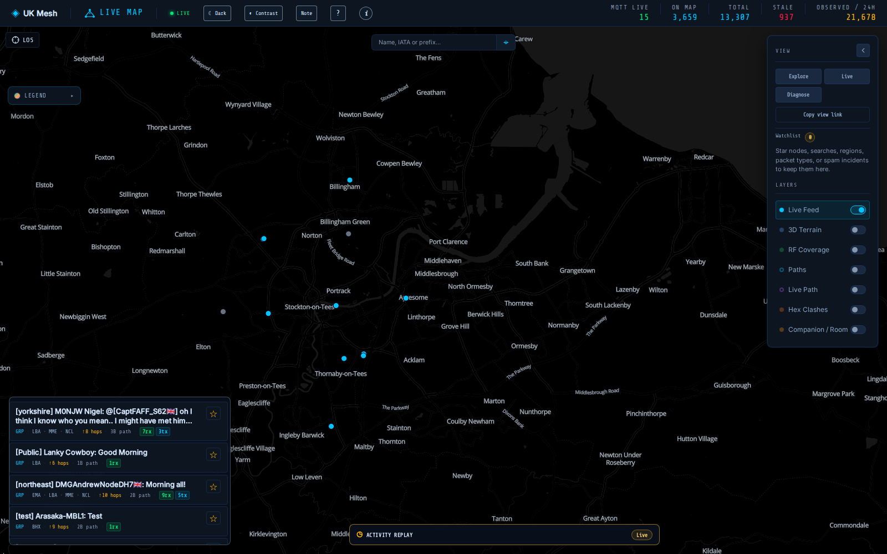

# UKMesh spring-clean: map feed and repeater rendering — 2026-08-06

## Result

Items 5, 7, 8, and 9 are implemented and deployed to the live `app-ukmesh`
dashboard. No backend source was changed. Item 6 was reproduced against the
live path resolver and checked in the browser with terrain enabled; no obvious
LOS/terrain violation was found, so no pathing code was changed.

## Items

- **Item 5 — message-first live feed:** `PacketFeed` now puts decoded message
  text first in a larger two-line summary. Group/type, IATA, hop count, path
  size, and receive counts are compact muted metadata below it. The feed has a
  fixed compact viewport so cards remain visible on the map.
- **Item 7 — stale repeaters:** map presence uses the data-driven
  `shouldRenderMapNode()` predicate in `geojsonBuilders.ts`. Nodes render only
  while the backend-provided effective `last_seen` is within 28 days; invalid
  timestamps are hidden. The backend effective timestamp already incorporates
  advert/status/position and valid multibyte path evidence, so a repeater
  carrying recent packet-hop traffic remains present. This is a rendering
  filter only; no rows are deleted.
- **Item 8 — MQTT repeaters:** removed the remaining link-only-stale special
  rendering and palette branch. The normal repeater fallback is used instead;
  MQTT-only identity does not receive a special map appearance.
- **Item 9 — repeater polish:** aligned the node popup, legend, search/detail
  entries, borders, radii, spacing, colors, typography, and focus states with
  the existing UKMesh design tokens. Behavior is unchanged.

## Item 6 visual verification

The live Googlebot browser reproduced a real packet with a resolved multibyte
path. One successful pass used the message `[yorkshire] Galena 🥜: Lots of Faff
and lots of swarf` (`3B path`, 11 hops); `/api/path-beta/resolve-multi` returned
HTTP 200 with six coordinate-bearing canonical nodes and seven rendered
`purplePath` points at confidence `0.4252`. Terrain was enabled in the map
(`3D Terrain` pressed). The frontend path therefore rendered as an ordered
terrain-aware hop chain between resolved coordinates, with no apparent wild
cross-country jump or impossible leg in the live pass. No LOS/ITM violation was
identified and no path code was changed.

The combined path-plus-popup capture was intentionally abandoned when the live
feed state expired during repeated deep-link attempts. The final screenshot is
the requested best-effort stable map/feed evidence and focuses on Item 5.

## Verification and deployment

- Frontend: `npx tsc --noEmit` passed; `npm test` passed **77/77**;
  `npm run lint:css` passed; `npm run build` passed with only existing
  large-chunk warnings.
- Backend: `npx tsc --noEmit` passed; `npm test` passed **273/273**. No backend
  files changed.
- Built with real tags:
  `meshcore-analytics-app:spring-mapfeed` and
  `meshcore-analytics-website:spring-mapfeed`.
- Deployed only `app-ukmesh` and `website-ukmesh`.
- Final app image:
  `sha256:4a0ac805ec579b970dcb518e397d38b7ae15ff45469bc94066b75635336fc2dd`.
- Final website image:
  `sha256:965ce6fa65f6d006fe4dc8fd863f5516da39f98965278d48d746421169d1f861`.
- Live checks: `/api/health` returned `healthy`; `/hopreach/api/nodes`
  returned HTTP **200**. `.env` image pins were updated only for the deployed
  app and website images; secret configuration was not touched.

## Evidence

The stable Googlebot map capture shows a real message as the primary feed text,
with compact secondary metadata including `↑8 hops` and `3B path`:

Implementation commit: `4569831` (`feat(map): spring-clean live feed and
repeater rendering`). The follow-up local commits include `52820d0`
(`fix(map): keep live feed viewport visible`) and the records/evidence commit.
Nothing was pushed to GitHub.
