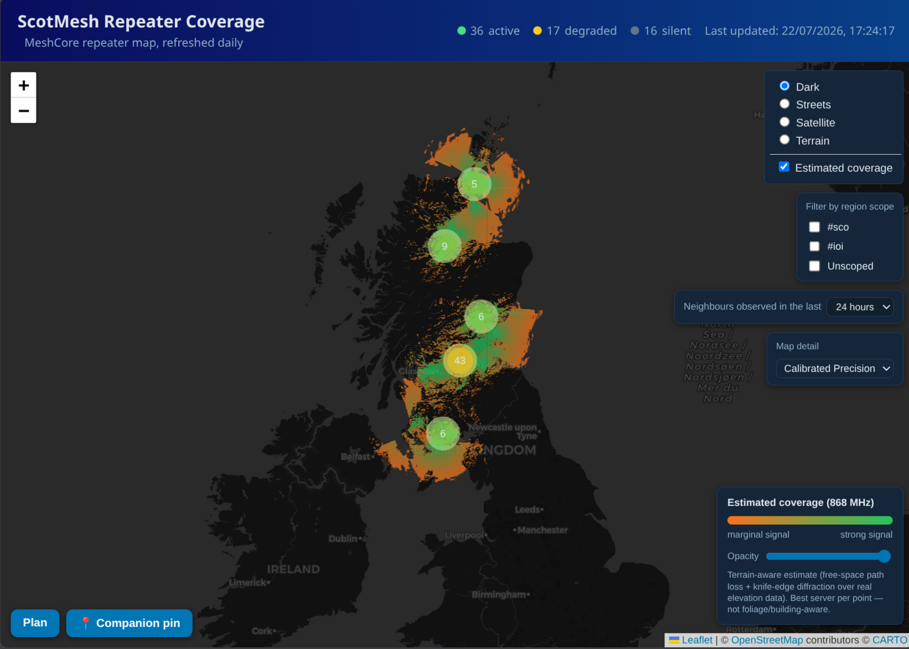
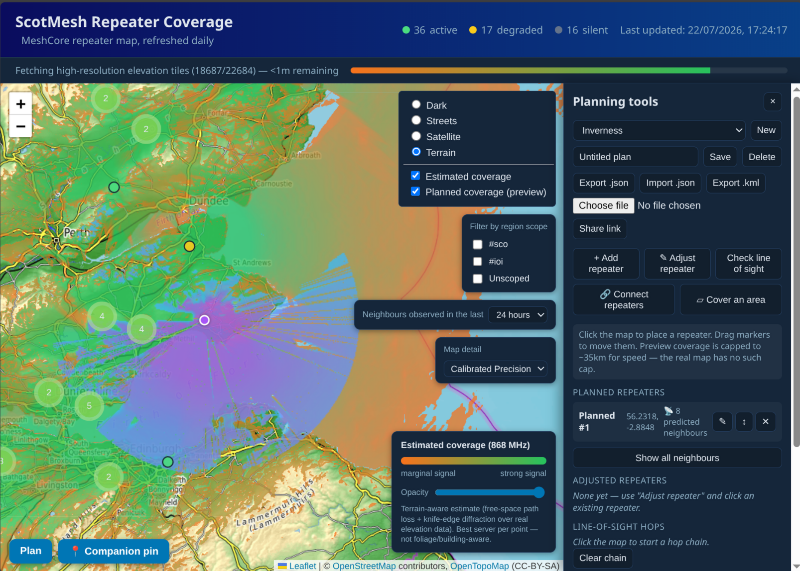
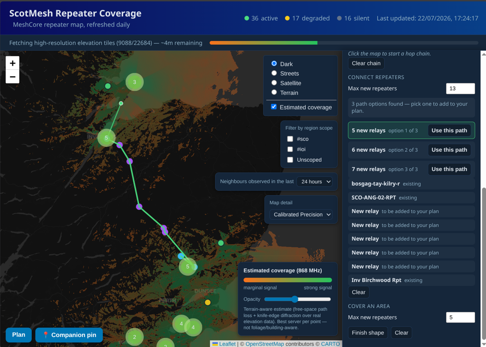
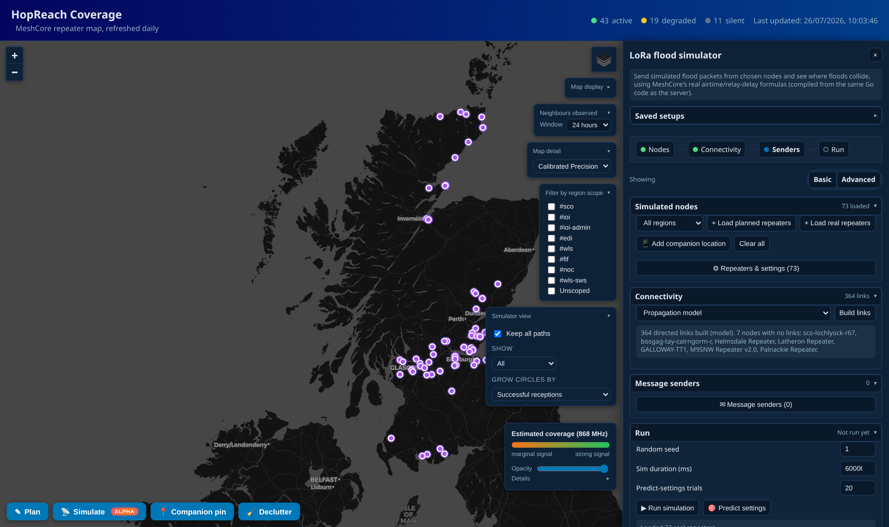
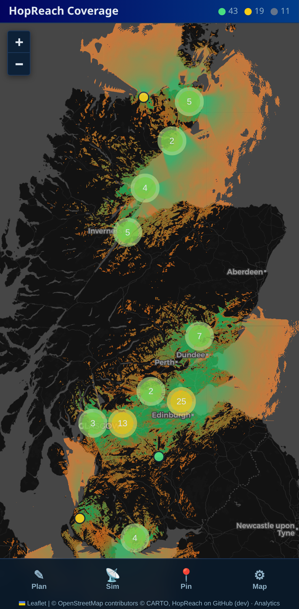
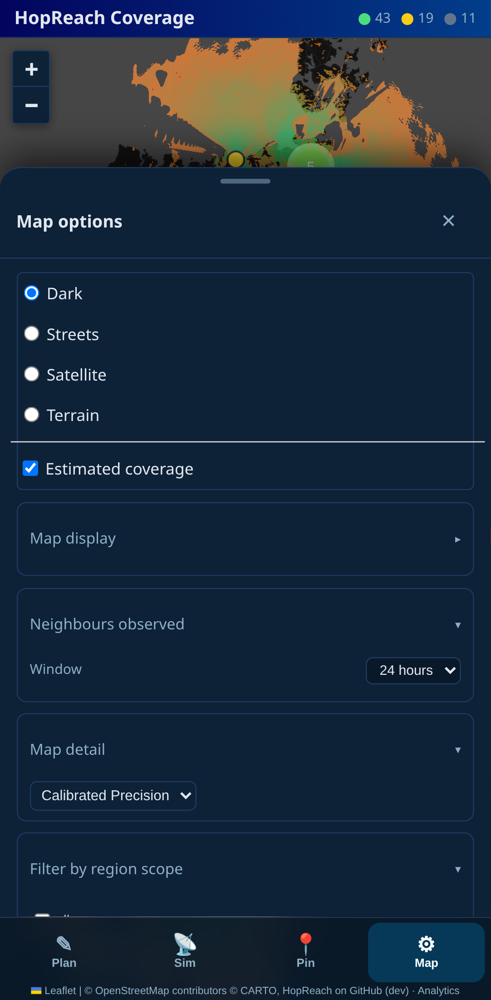
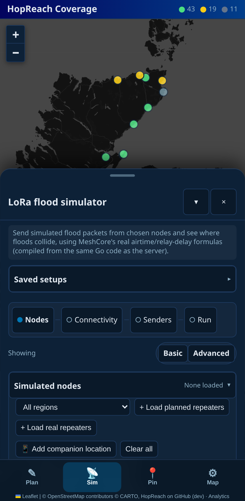

<p align="center">
  
</p>

<p align="center">
  <b>See where your mesh actually reaches — over real terrain, not circles on a map.</b>
</p>

<p align="center">
  <a href="https://scotmesh-coverage.mm7roq.compute.oarc.uk"><b>Live demo — ScotMesh Repeater Coverage</b></a>
  &nbsp;·&nbsp;
  <a href="docs/TECHNICAL.md">Technical reference</a>
  &nbsp;·&nbsp;
  <a href="docs/simulator-model.md">Simulator model</a>
</p>

---

# HopReach

HopReach turns a [CoreScope](https://github.com/Kpa-clawbot/CoreScope)
instance into an interactive coverage map for your
[MeshCore](https://meshcore.co.uk/) repeater network — then lets you plan
changes to it and simulate how traffic would actually flow.

It reads every `role=repeater` node, keeps the ones inside your region, and
computes a **terrain-aware coverage estimate** from real elevation data with
line-of-sight and diffraction analysis on every path. Not a distance circle
around each site — the actual hills in the way.

Everything runs from **one Docker container** that refreshes itself daily.

## Quick start

```bash
git clone https://github.com/A13xB0/hopreach.git
cd hopreach
cp config.example.yaml config.yaml
docker compose up --build
```

Open `http://localhost:8080`. No GPU required, no API keys, no accounts.



> ⚠️ **Vibe-coded software.** Built with heavy AI assistance rather than
> fully by hand. The core physics is cross-checked between the server and
> the WebAssembly build the browser shares with it, it's been exercised
> against real data, and human review has been endeavoured throughout — but
> it hasn't had independent code review from someone who wasn't also
> steering the AI. Read the source before relying on it for anything
> safety-critical or professional.

---

## What you can do with it

### See real coverage

A nightly terrain-aware raster over your whole region, rendered as a
heatmap you can fade in and out. Four versions are computed — reported vs.
[calibrated](docs/TECHNICAL.md#position-calibration) positions, each at
standard and high detail — and a dropdown switches between them live.
Repeaters are colour-coded active / degraded / silent, and each one's popup
lists the neighbours it's actually been heard by.

Filter the whole map down to a single region tag (`#edi`, `#fif`, …) —
including a coverage overlay computed for **just that region's** repeaters,
so you can see what one community's own infrastructure covers on its own.

### Planning and what-if tools

Sketch changes to the network **entirely in your browser** — nothing is sent
anywhere, and it uses the same physics as the real map.



- **Add a repeater** — click to drop a site and watch its predicted coverage
  appear in blue→purple, deliberately distinct from the real map's
  orange→green so proposed and existing never blur together. Drag it around
  and the prediction follows.
- **Check line of sight** — click a chain of points and get each hop drawn
  by margin: green clear, orange marginal, red blocked, with distances and
  dB in the panel.
- **🔗 Connect two repeaters** — it works out the fewest *new* sites needed
  to bridge them, reusing existing infrastructure for free, and offers up to
  three route options to choose between.
- **▱ Cover an area** — draw a polygon and it places up to N new repeaters
  for maximum coverage of what's inside, reporting the before/after
  percentage.
- **✎ Adjust a real repeater** — reposition or re-height any existing site
  *for yourself* to test a "what if we moved it" idea. The official marker
  never changes; your version renders as a linked amber marker.
- **📍 Companion pin** — drop a pin anywhere and see who'd hear a handheld
  at that spot, with its own adjustable height.



Plans live in your browser, export to `.json` or `.kml` for Google Earth,
and **Share** produces a link anyone can open — carrying the plan's
structure, never a stale rendered image, so it stays live and interactive
for whoever you send it to.

### LoRa flood simulator

Test and tune MeshCore's flood-relay timing before touching a real device.



Built from a faithful port of MeshCore's own airtime, packet-score,
retransmit-delay and duty-cycle formulas — verified line-for-line against
the firmware source, not a secondhand approximation.

- **Load your network** — planned repeaters, the real ones, or both, plus
  virtual companion devices anywhere you click.
- **Choose how links are decided** — the terrain model, CoreScope's real
  observed reach data, or a blend of the two.
- **Schedule sends and watch the flood** — an animated replay steps through
  it wave by wave, with a scrub bar to drag back and forth through time.
- **See exactly why a packet didn't arrive** — not one vague "collided", but
  the real cause: nothing ever locked, lock lost to a stronger interferer,
  or the listener's own transmitter was keyed (LoRa is half-duplex).
- **🏆 Per-repeater scoreboard** — duty cycle, real delivery, and the one
  that matters most: unique deliveries vs. redundant relays. Is this
  repeater's airtime reaching anyone new?
- **🧬 Search better settings** — grid-search and multi-rule policy search
  ranked by actual delivery ratio, ending in a per-repeater action list with
  copy-pasteable MeshCore CLI lines.
- **🔥 Stress test** — push synthetic load until it breaks and report the
  knee: how many messages this specific network can actually handle.

**Replay a real packet.** Paste a CoreScope packet hash and it reconstructs
what genuinely happened — every relay there's proof of — then runs its own
simulation from the same origin and compares. Hops the model predicted but
nobody observed show as dashed amber (candidates for where interference
actually hit); hops that really happened but the model doesn't even think
possible show in blue. That difference is the interesting part.

### Works properly on a phone

Not a shrunken desktop layout. Below 700px the whole thing switches to a
phone design: a bottom tab bar, and Plan/Simulate/Map as **drag-resizable
bottom sheets** you can minimise to a title strip to watch a simulation run
on the live map behind them.

<p align="center">
  
  
  
</p>

---

## Not just Scotland

Scotland is the built-in default, but nothing is hard-wired to it. Point
`region.boundary_url` or `region.boundary_path` at any GeoJSON — a country, a
county, a custom shape you drew — and that becomes the area of interest.
See [Region](docs/TECHNICAL.md#region-not-just-scotland).

## Want it faster?

Coverage computation is the expensive part. With a compatible GPU it's
roughly **50× faster** for the same raster — one extra compose file, no code
changes. There's also a remote-worker mode, so a headless box with a GPU can
do the maths for a small VPS that hasn't got one.
See [GPU-accelerated compute](docs/TECHNICAL.md#gpu-accelerated-coverage-compute-optional).

## Going further

| | |
|---|---|
| [**Technical reference**](docs/TECHNICAL.md) | How the coverage estimate works, position calibration, the detail tiers, GPU and remote-worker setup, the shared WASM core, full configuration reference, local development, project layout |
| [**Simulator model**](docs/simulator-model.md) | The event model, airtime and frame sizing, capture/collision rules, timing, region scoping, and where it deliberately diverges from real firmware |
| [**`config.example.yaml`**](config.example.yaml) | Every setting, documented inline |

## License

[AGPL-3.0](https://www.gnu.org/licenses/agpl-3.0.html) plus the
[Commons Clause](https://commonsclause.com/) — see [`LICENSE`](LICENSE) for
the full text. In short: use, copy, and modify freely; if you distribute it
or run a modified version as a network service others can talk to, you must
make the corresponding source available under the same license; you may
**not** sell this software or a service substantially based on it. Provided
free of charge, for personal and non-commercial use, with no warranty and no
support.
